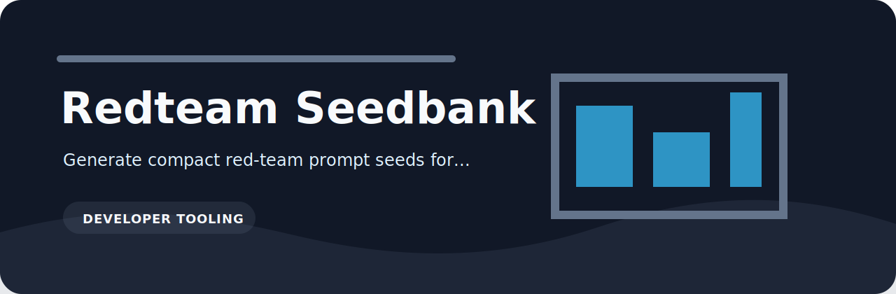

# Redteam Seedbank

A deterministic seed catalog for quick application safety checks.



## Categories

`prompt-injection`, `data-exfiltration`, `overreliance`, `policy-boundary`, and `tool-abuse`.

## Use it

```bash
git clone https://github.com/mertefekurt/redteam-seedbank.git
cd redteam-seedbank
python -m pip install -e ".[dev]"
redteam-seedbank list
redteam-seedbank sample --category tool-abuse --count 2 --seed 7
```

Each seed has an ID, category, prompt, and expected behavior. That keeps small evaluations repeatable without turning them into a large benchmark project.
