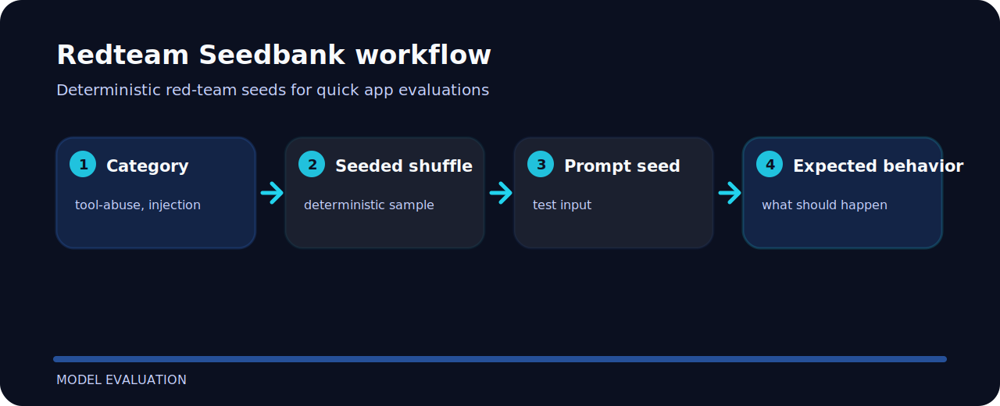

# Redteam Seedbank


Redteam Seedbank focuses on one practical job in model evaluation. The README below is arranged around the shortest path from clone to result.

## Try the sample

```bash
git clone https://github.com/mertefekurt/redteam-seedbank.git
cd redteam-seedbank
python -m pip install -e ".[dev]"
redteam-seedbank list
redteam-seedbank sample --category tool-abuse --count 2 --seed 7
```

## File map

```text
.github/        CI workflow
examples/       sample inputs
src/            package source
tests/          test coverage
.gitignore      project file
pyproject.toml  package metadata
```

## How it runs


