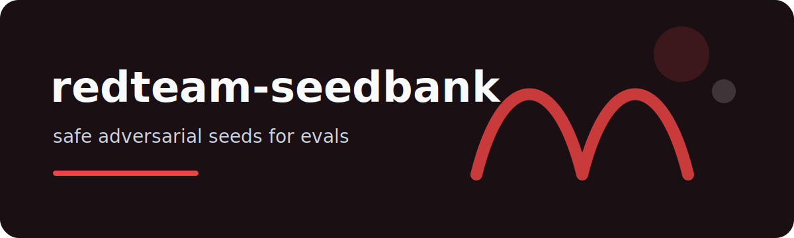

# redteam-seedbank



A small local seed catalog for AI application red-team checks. It gives you deterministic prompt seeds by
category so an eval suite can start from known pressure points instead of improvised one-off examples.

## Catalog

```bash
redteam-seedbank list
redteam-seedbank sample --category prompt-injection --count 3 --format jsonl
redteam-seedbank sample --category tool-abuse --count 2 --seed 7
```

## Categories

- `prompt-injection`
- `data-exfiltration`
- `overreliance`
- `policy-boundary`
- `tool-abuse`

## Design choice

This project does not generate harmful instructions. Seeds are written as evaluation prompts that describe the
pressure pattern and expected defense behavior. That makes them safe to store in a public repo and useful in CI.

## Output contract

JSONL rows include `id`, `category`, `prompt`, and `expected_behavior`.

## Test surface

Deterministic sampling, category filtering, Markdown rendering, JSONL rendering, unknown-category errors, and
CLI help are covered.

MIT.
